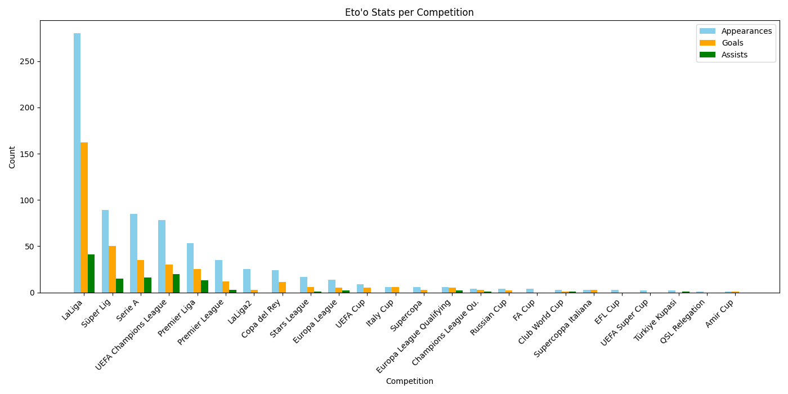

# ⚽ PlayerStat_visualiser

`PlayerStat_visualiser` is a Python project that scrapes and visualizes the football stats of iconic players—starting with **Samuel Eto’o**—from [Transfermarkt](https://www.transfermarkt.com/).

It extracts appearances, goals, assists by competition, and titles won over their career. The data is displayed using **Matplotlib** in visually rich formats such as bar charts, with plans for spider charts and player comparisons.

---

## 📊 Features

- Bar chart showing:
  - Appearances
  - Goals
  - Assists
- Trophy history per club and year
- JSON data export
- Extendable to other players (e.g., Didier Drogba)

---

## 📂 Files

| File Name            | Purpose                                  |
|----------------------|-------------------------------------------|
| `etoo_stats.json`    | Cleaned stats from Transfermarkt          |
| `visualise_data.py`  | Renders bar chart from player stats       |
| `data_scraper.py`    | Scrapes stats by competition              |
| `trophy_scraper.py`  | Scrapes trophy records                    |

---

## 🖼️ Preview



---

## ⚙️ Requirements

Make sure you have Python 3.7 or higher installed.

Install the dependencies:

```bash
pip install matplotlib pandas
